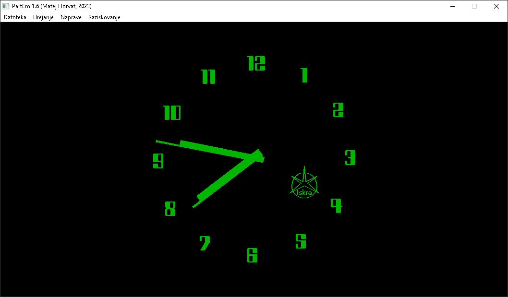

![status.badge] [![language.badge]][language.url] [![standard.badge]][standard.url] [![license.badge]][license.url]

# ura

The (famous!) Iskra clock for the Iskra Delta Partner computer.

## Compiling

*To compile, you will need a Linux machine with the latest version of the SDCC suite.*

This repository uses submodules. When you clone it, don't forget to add the `--recursive` switch.

Use `make` to compile the chess. 

Afterwards, you can find the disk image in the `bin/` directory and the `*.com` files in the `build/` directory.

# Credits

Many thanks to **Rok Benedik** (@benedikrok) for [his restoration project](https://twitter.com/benedikrok/status/1765002727724060740/photo/1) which inspired this port.

[language.url]:   https://en.wikipedia.org/wiki/ANSI_C
[language.badge]: https://img.shields.io/badge/language-C-blue.svg

[standard.url]:   https://en.wikipedia.org/wiki/C89/
[standard.badge]: https://img.shields.io/badge/standard-C89-blue.svg

[license.url]:    https://github.com/tstih/idp-quill/blob/main/LICENSE
[license.badge]:  https://img.shields.io/badge/license-MIT-blue.svg

[status.badge]:  https://img.shields.io/badge/status-stable-dkgreen.svg